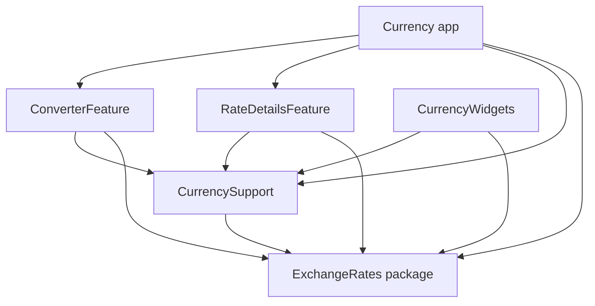

# Architecture review

The review covered all Swift production/test sources, SwiftPM and Tuist manifests, app/extension configuration, and existing project documentation. The main problems were mixed package responsibilities, an app-owned feature implementation, broad decoder APIs, and storage that could not be isolated from the production container.

## Resulting boundaries



The app supplies the converter's details destination and creates the shared history service. Neither feature imports the other. Feature models, supporting views, widget intents, feed decoders, and storage identifiers are internal or private. Public service outputs are immutable; converter state changes use operations that preserve currency-list invariants.

`ExchangeRates` is one independently usable package, with automatic and dynamic linking products exposing the same module. It contains conversion, providers, current refresh policy, rate persistence, and historical series. Hosts inject providers, HTTP clients, cache directories, and evaluation times. App-specific state, formatting, error copy, App Group integration, and refresh scheduling remain in Tuist targets. The reusable package supports iOS 16+ and macOS 14+; the SwiftUI app still requires iOS 26.

## Naming and compatibility

- `RateCore` → `ExchangeRates`: a product name describing its capability.
- `Quote` / `RateBook` / `DiskStore` → `ExchangeRate` / `RateSnapshot` / `RateCache`.
- `FiatProvider` → `FallbackRateProvider`: names its configurable chaining behavior.
- `InputState` / `SharedStore` → `ConverterState` / `CurrencyStore`.
- `from` / `to` state properties → `source` / `primaryDestination`, with legacy JSON coding keys retained.
- Integer history arguments → `HistoryRange`; recoverable string messages → typed conditions with app-owned copy.

Existing rate/input/history file names, bundle identifiers, App Group, widget kinds, and URL scheme remain compatible. Provenance now encodes structured metadata; its decoder migrates legacy source strings, so existing caches remain readable. This is a source-level API change for consumers of the previous local package.

## Correctness and tests

Critical tests cover Decimal cross-conversion and invalid inputs; provider validation and fallback; daily freshness/manual override; equal-date provider precedence; restoration of daily crypto after live failures; cache corruption, including daily fallbacks; history pagination and offline retention; keypad limits; legacy state decoding; list normalization; value-preserving source promotion with currency precision; and coordinated input persistence.

Two defects found during the review are covered explicitly: invalid saved daily quotes could pass cache validation, and ignored keypad commands updated the edit timestamp and delayed widget refresh. Both are corrected. Tests use stub providers/HTTP clients and temporary directories, with no live feed dependency.

## Verification

From the repository root:

```sh
swift test
tuist generate --no-open
swift format lint --recursive --strict Sources Modules App/Sources Widgets/Sources
```

In Xcode, build `Currency`, run tests in the `CurrencySupport` scheme on an iOS 26 simulator, and use Build Documentation. For command-line builds/tests, pipe combined `xcodebuild` output through `xcbeautify` with `set -o pipefail`. Strict documentation validation uses `docbuild` with `OTHER_DOCC_FLAGS='--warnings-as-errors --analyze'`.

The app's active refresh cadence and WidgetKit scheduling behavior are unchanged. Unit tests and simulator builds do not replace physical-device widget latency, accessibility, or provisioning checks described in the existing product documentation.

## Localization follow-up

The package manifest and conventional Sources/Tests layout now live at the repository root for direct use from other repositories. `CurrencyCode` defines supported codes once; presentation switches use typed cases. Features own English string catalogs and use native generated accessors. See [localization](Localization.md) for resource ownership and [the independent review](IndependentReview.md) for the addressed P2 findings.

Provider provenance is `RateSource`: a typed provider identity, observation semantics, and optional time zone. The package emits no localized display sentences. Consumers own wording; only the legacy decoder recognizes former English source strings.
