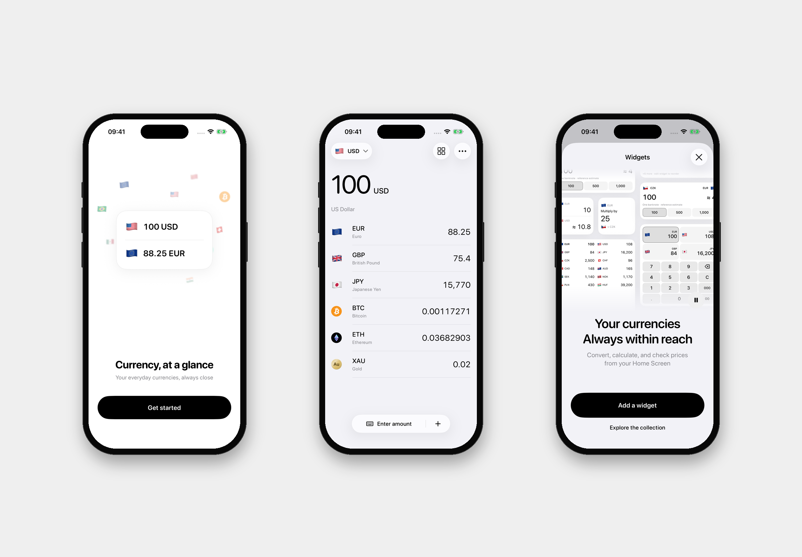

# Currency

A simple SwiftUI currency converter for iPhone and iPad, running iOS 26 or later.

[Join the TestFlight beta](https://testflight.apple.com/join/qepuraVw) · [Report an issue](https://github.com/DimaMishchenko/currency/issues)

[](https://github.com/DimaMishchenko/currency/actions/workflows/tests.yml)

## Overview

- Convert currencies, crypto, and precious metals with your own currency list.
- Keep converting offline with saved rates.
- Explore exchange-rate history and see rates on Home and Lock Screen widgets.



## Run locally

Install Xcode 26 or later and [mise](https://mise.jdx.dev/), then run:

```sh
mise install
mise exec -- tuist install
mise exec -- tuist generate
```

Open the `Currency` scheme and choose an iOS 26+ simulator. No Tuist account is required.

## Development

`App/` composes the app and widgets, `Features/` owns screens, `Domain/` owns reusable logic, and `DesignSystem/` holds shared UI primitives.

[Development guide](Documentation/Development.md) · [Architecture](Documentation/Architecture.md) · [Decisions](Documentation/Decisions.md) · [Third-party assets](Documentation/ThirdPartyAssets.md)

## Acknowledgements

[e2e](https://github.com/tester-army/e2e) powers the real-app end-to-end test suite.
